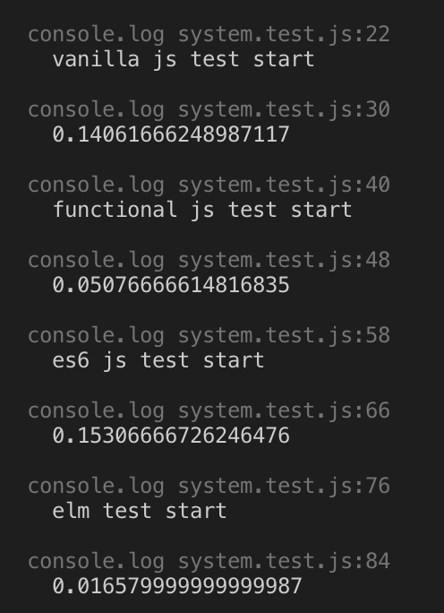

# The Brick Break

A visualisation of the same game built using four different paradigms. The execution time of the update function in each game is profiled and the speed of the balls are mapped to their respective performance values.

https://www.thebrickbreak.com/


## Getting Started

To run the visualisation:

```
npm start
```

### Structure

Visualisation:

```
src/
```

Performance tests:

```
profiling/
```

End with an example of getting some data out of the system or using it for a little demo

## Running the tests

First run each game on a separate server (using ports: 8000, 8001, 8002, 8003) and then run:

```
npm test
```



## License

This project is under the GPLv3 licence. See license.txt.