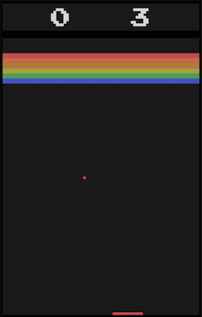

# Breakout - functional Javascript
This is part: 3 of a series of projects building a clone of the Atari game Breakout using different javascript paradigms:
* [Breakout - Javascript prototypal inheritance](https://github.com/markorodic/breakout-game)
* [Breakout - Javascript es6 classes](https://github.com/markorodic/breakout-game-es6-classes)
* Breakout - functional Javascript
* [Breakout - Elm](https://github.com/markorodic/elm-breakout-game)

A blog comparing and discussing the things that I learnt can be found [here](https://medium.com/@mrmarkorodic/building-a-game-in-four-different-ways-f629f91934c2).

### In Game Screenshot

### Controls
Controls for Breakout using the following keys:

* Spacebar to start the game/ball
* Right arrow to move the paddle right
* Left arrow to move the paddle left

### Acknowledgments
Inspired by the Mozilla tutorial:
* https://developer.mozilla.org/en-US/docs/Games/Tutorials/2D_Breakout_game_pure_JavaScript
